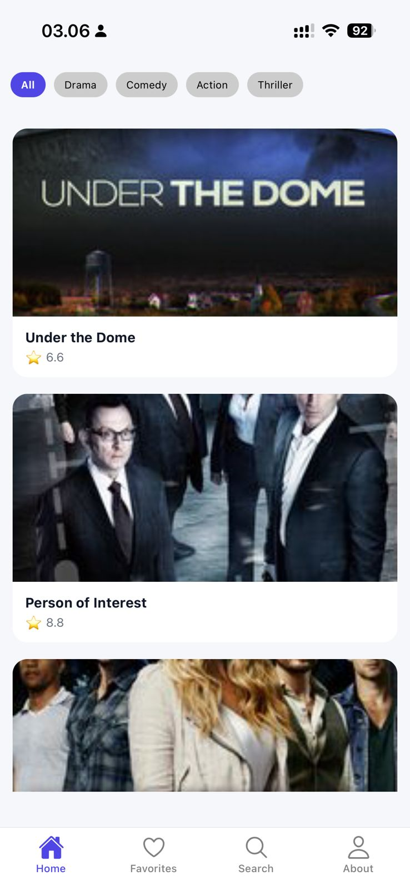
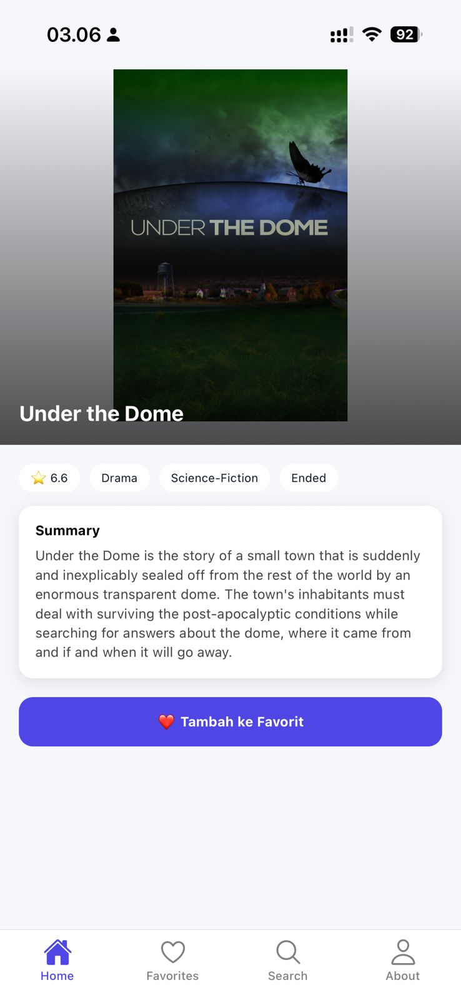
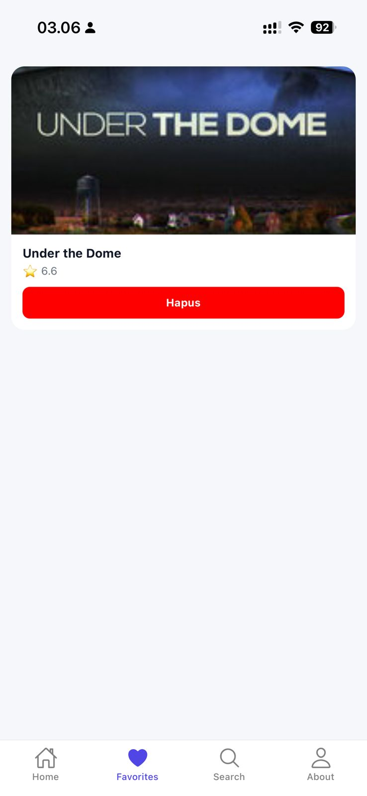
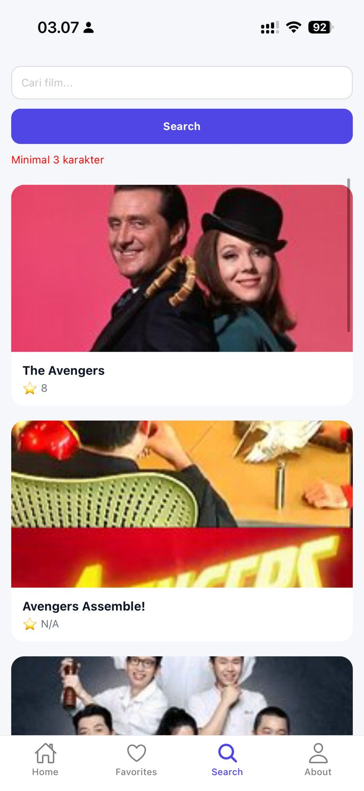
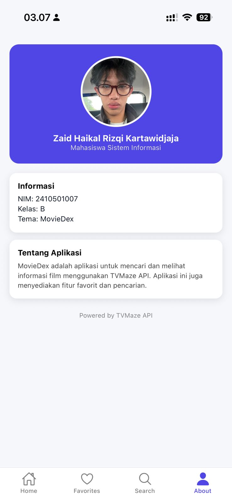

# 🎬 MovieDex App

## Identitas
- Nama: Zaid Haikal Rizqi Kartawidjaja  
- NIM: 2410501007  
- Kelas: B  
- Tema: MovieDex  

---

## Deskripsi Aplikasi
MovieDex adalah aplikasi mobile berbasis React Native yang digunakan untuk mencari dan menampilkan informasi film menggunakan API dari TVMaze. Aplikasi ini juga menyediakan fitur pencarian serta penyimpanan film ke dalam daftar favorit.

---

## Tech Stack
- React Native (Expo SDK 54)
- React Navigation (Stack Navigator & Bottom Tab Navigator)
- Context API + useReducer
- AsyncStorage
- Fetch API

---

## Fitur Utama
- 🏠 Home  
  Menampilkan daftar film dari API + loading + error handling + pull-to-refresh  

- 📄 Detail  
  Menampilkan informasi lengkap film + tombol tambah ke favorit  

- ❤️ Favorites  
  Menampilkan daftar favorit + hapus data + navigasi ke detail  

- 🔍 Search  
  Fitur pencarian film dengan validasi input minimal 3 karakter  

- 👤 About  
  Menampilkan informasi pembuat aplikasi dan deskripsi aplikasi  

---

## Cara Menjalankan Aplikasi

```bash
npm install
npx expo start
```

---

## Screenshot

Simpan di folder `/screenshots`

### Home Screen


### Detail Screen


### Favorites Screen


### Search Screen


### About Screen


---

## Video Demo
Link video demo: https://drive.google.com/file/d/11hLByeboPGsbecv-BAnG5-pc8uQPhCgB/view?usp=drivesdk 

---

## State Management
Aplikasi ini menggunakan Context API dengan useReducer untuk mengelola state favorit karena lebih sederhana dan cukup untuk kebutuhan aplikasi.  
Data favorit juga disimpan menggunakan AsyncStorage agar tetap tersimpan meskipun aplikasi ditutup.

---

## Referensi

- React Native - FlatList  
  https://reactnative.dev/docs/flatlist  

- React Native - ActivityIndicator  
  https://reactnative.dev/docs/activityindicator  

- React Navigation  
  https://reactnavigation.org/docs/getting-started  
  https://reactnavigation.org/docs/bottom-tab-navigator  

- TVMaze API  
  https://www.tvmaze.com/api  

- AsyncStorage  
  https://react-native-async-storage.github.io/async-storage/docs/usage/  

- React useReducer  
  https://react.dev/reference/react/useReducer  

- Stack Overflow (Navigation nested screen)  
  https://stackoverflow.com/questions/69701237/react-navigation-navigate-to-nested-screen  

- Stack Overflow (AsyncStorage React Native)  
  https://stackoverflow.com/questions/29294048/how-to-store-data-locally-using-asyncstorage-in-react-native  

---

## Refleksi
Dalam pembuatan aplikasi MovieDex ini, saya mempelajari bagaimana cara mengintegrasikan API ke dalam aplikasi mobile menggunakan React Native. Saya menjadi paham cara mengambil data menggunakan fetch, lalu menampilkannya secara efisien menggunakan FlatList. Selain itu, saya juga mempelajari penggunaan React Navigation untuk mengatur perpindahan antar halaman menggunakan kombinasi Stack Navigator dan Bottom Tab Navigator.

Saya juga belajar mengelola state global menggunakan Context API dan useReducer, yang sangat membantu dalam mengatur data favorit. Tantangan yang saya hadapi adalah dalam menghubungkan navigasi antar screen serta memastikan data favorit tetap tersimpan dengan baik. Untuk mengatasi hal tersebut, saya menggunakan AsyncStorage sehingga data tetap ada meskipun aplikasi ditutup.

Secara keseluruhan, melalui proyek ini saya menjadi lebih memahami alur pengembangan aplikasi mobile mulai dari pengambilan data, pengelolaan state, hingga pembuatan antarmuka yang interaktif dan user-friendly.